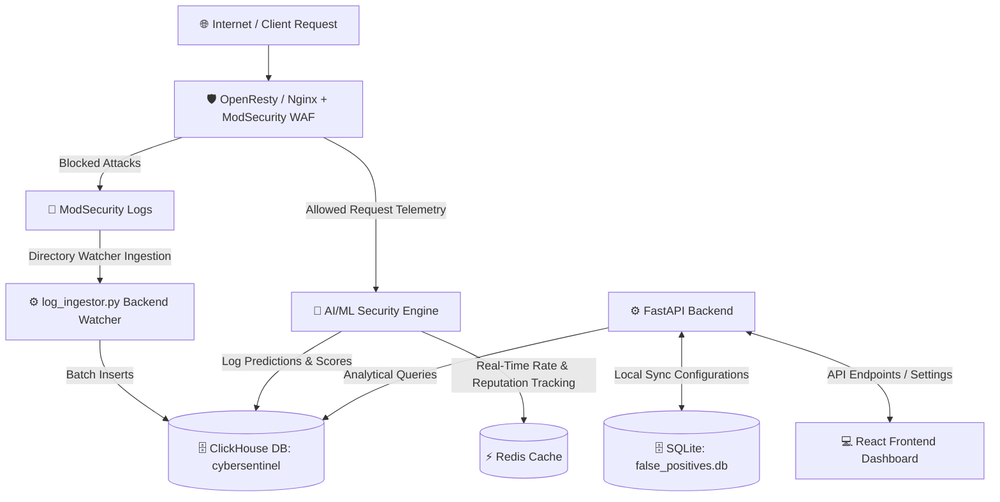

# CyberSentinel WAF (Web Application Firewall)

Welcome to CyberSentinel WAF, an advanced, intelligent Web Application Firewall (WAF) dashboard and security platform. 

Whether you are a system administrator, a security engineer, or a non-technical business manager, this guide will help you understand exactly what CyberSentinel WAF is, how it protects your digital assets, and how the entire system is built and operates.

---

## 🌟 What is CyberSentinel WAF? (The Security Guard Analogy)

Imagine your website or web application is a highly secure building. **CyberSentinel WAF acts as the intelligent security guard standing at the front door.**

Every time a user, a software program, or a search engine tries to visit your website, CyberSentinel WAF checks their credentials and behavior:
* **The Normal Visitor:** If it's a regular user browsing your site, CyberSentinel lets them in instantly with zero delay.
* **The Hacker or Bad Bot:** If someone tries to break in, inject malicious code, guess passwords, or crash the site, CyberSentinel WAF immediately blocks them at the door, shuts down their access, and logs the incident.

---

## 📋 Prerequisites

To run, compile, or develop CyberSentinel WAF, your environment must meet the following requirements:

### System Environment
* **Operating System:** Linux (Debian 11+ or Ubuntu 20.04+ recommended)
* **Web Server Gateway:** OpenResty (v1.19+) or Nginx compiled with `ngx_http_lua_module` and `modsecurity` modules
* **WAF Library:** ModSecurity (v3.0.0+) dynamic security library (`libmodsecurity`)
* **Ruleset:** OWASP Core Rule Set (CRS v3.3+)
* **In-Memory Cache:** Redis Server (v6.0+) running on port `6379` (essential for real-time request-per-minute limits and reputation tracking)
* **Log & Analytical Database:** ClickHouse (v24.6+ alpine) server (primary high-throughput log store); SQLite3 (local synchronization fallback for configurations)


### Development Runtimes
* **Backend Subsystem:** Python (v3.10+) and `pip3` package manager
* **Frontend Subsystem:** Node.js (v18.0+) and `npm` package manager

---

## 📂 Folder Structure

Here is an overview of the directory structure of the CyberSentinel WAF repository:

```text
/opt/ModSecurity/WAF_GUI/
├── backend/                      # Python FastAPI backend server
│   ├── requirements.txt          # Python dependencies for the backend
│   ├── app/                      # Application core package
│       ├── main.py               # FastAPI configuration & routing registry
│       ├── config/               # System settings files & SQLite databases
│       │   ├── settings.json     # Active system configurations (WAF, DDoS, etc.)
│       │   ├── rule_states.json  # Cached ModSecurity CRS rule states
│       │   └── false_positives.db # SQLite database storing false positive overrides
│       ├── routes/               # REST API endpoints (logs, rules, settings, etc.)
│       ├── services/             # Business logic layer (Nginx manager, db, shell executors)
│       ├── parsers/              # System log parsers (ModSecurity audit log parser)
│       ├── models/               # Pydantic schemas and schema models
│       └── websocket/            # Live logs real-time WebSocket connection manager
│   └── tests/                    # Pytest suite (auth, users, MFA, WebSocket auth, notification prefs)
├── ml-waf/                       # Machine Learning Security Engine (subsystem)
│   ├── ml_server.py              # FastAPI microservice exposing scoring Rest APIs
│   ├── requirements.txt          # Python machine learning dependencies
│   ├── threat_score.py           # Core threat score compilation logic
│   ├── feature_pipeline.py       # Raw data vectors feature extraction pipeline
│   ├── drift_monitor.py          # Auto-detects model drift and triggers retraining
│   ├── collect_data.py           # Compiles audit logs into training datasets
│   ├── train_xgb.py              # Script to train the XGBoost model
│   ├── train_iso.py              # Script to train the Isolation Forest model
│   ├── ml_check.lua              # Lua hook script executing in OpenResty proxy context (loaded by OpenResty on every request)
│   └── retrain.sh                # Shell automation script to retrain ML models
├── frontend/                     # Dedicated Frontend Workspace Folder (React + Vite)
│   ├── src/                      # Vite + React Frontend Dashboard
│   │   ├── main.jsx              # React application entrypoint
│   │   ├── App.jsx               # Primary layout, lazy-loaded routes, navigation, and tab renders
│   │   ├── index.css             # Global styles, CSS custom-property design tokens, and theme (light/dark)
│   │   ├── pages/                # One file per sidebar tab (Overview, Events, Rules, Settings, etc.)
│   │   ├── components/           # Reusable UI component modules (Login, modals, Toast, EmptyStates, ...)
│   │   ├── context/               # React context providers (Theme, Confirm dialog)
│   │   ├── hooks/                 # Shared hooks (useToast, useConfirm, useEscapeToClose)
│   │   ├── utils/                 # Formatting/date helpers
│   │   ├── test/                  # Vitest + React Testing Library setup & tests
│   │   └── services/             # Frontend API services layer
│   │       └── api.js            # API request clients wrapper to fetch backend APIs (cookie-based auth)
│   ├── public/                   # Public assets (icons, static graphics)
│   ├── package.json              # NPM scripts and dependency packages list
│   ├── package-lock.json         # Pinned packages dependency tree
│   ├── vite.config.js            # Vite build environment configuration
│   └── eslint.config.js          # ESLint code style syntax rules config
├── configs/                      # Configuration files folder
│   ├── nginx/                    # Nginx reverse proxy, ModSecurity CRS rules, per-app vhosts
│   │   ├── sites-available/      # Dashboard vhost + generated protected-app vhosts
│   │   ├── modsec/                # main.conf, coreruleset/, rules-override.conf, positive-security.conf, app-auth/
│   │   └── conf.d/                # Generated DDoS/rate-limit config
│   └── clickhouse/               # ClickHouse schema scripts
│       └── init.sql              # Automated DB table schemas initialization
├── scripts/                      # System administration & deployment scripts
│   ├── update-crs.sh             # Core Rule Set updater script
│   ├── deploy-frontend.sh        # Frontend distribution builder and deployment script
│   ├── generate-secrets.sh       # Generates secure env keys/passwords for a fresh deployment
│   ├── configure-production.sh   # Post-install SSL/CORS reconfiguration tool
│   ├── reset-password.py         # Admin/analyst password reset utility (operates on users.db)
│   ├── migrate_sqlite_to_clickhouse.py # One-time SQLite to ClickHouse database migrator
│   └── verify_clickhouse_db.py   # Diagnostic script verifying ClickHouse logging pipeline
├── .github/workflows/            # CI: backend pytest, frontend lint/test/build, Docker build sanity checks
└── dist/                         # Compiled production distribution directory (served by Nginx)

```

---

## 📍 Important File Paths

Quick reference mapping of important files, configuration, and log paths:

| Component | File Path | Description |
|---|---|---|
| **System Settings** | `backend/app/config/settings.json` | Stores WAF modes, IP blacklists/whitelists, and DDoS thresholds |
| **CRS Rule States** | `backend/app/config/rule_states.json` | JSON list of active/inactive Core Rule Set rules |
| **Analytical Database** | ClickHouse `cybersentinel` | Central analytical store containing `waf_events`, `ml_events`, `analyst_feedback`, `api_discovery`, `alert_history` tables |
| **Local Configurations DB** | `backend/app/config/false_positives.db` | Local SQLite database fallback storing exclusions, rule states, and analyst overrides |
| **User Accounts DB** | `backend/app/data/users.db` | SQLite database of dashboard accounts (admin/analyst), password hashes, roles, and MFA secrets |
| **ML Lua Integration**| `ml-waf/ml_check.lua` | Request inspection script loaded inside OpenResty request cycles |
| **Nginx Config** | `/etc/nginx/nginx.conf` | Primary configuration mapping request proxies |
| **ModSecurity Config**| `/etc/nginx/modsec/main.conf` | Core configurations file listing WAF rules and OWASP CRS rules |
| **WAF Audit Log** | `/var/log/nginx/modsec_audit.log` | ModSecurity transactional audit log read by the backend parser |
| **Backend Service Log**| (Container stdout logs) | View via docker logs: `sudo docker compose logs -f waf-backend` |


---

## 🛡️ Core Security Features

1. **Active Threat Blocking:** Instantly detects and blocks common hacker attacks (such as SQL Injection, Cross-Site Scripting (XSS), and Path Traversal) before they reach your web application.
2. **AI/ML Security Engine:** An intelligent machine-learning layer that analyzes traffic behavior and scores the "threat level" of users to catch new, sophisticated attacks that traditional rules might miss.
3. **DDoS & Bot Mitigation:** Limits request speeds and blocks automated bots that try to overwhelm your server or scrape your website content, with optional GeoIP2-based country rate-limiting and a JS-Challenge interstitial mode that filters out scripted bots without an outright block.
4. **API Protection:** Automatically discovers application endpoints from live traffic, assigns a security grade (A to F) to each one (TLS, compression, auth signals), and lets an analyst turn that grade directly into enforcement — one click adds a traffic-suggested rate limit, or fully blocks a specific method+endpoint combination.
5. **Web Anti-Defacement (File Integrity):** Monitors files on the server in real-time. If an unauthorized attacker somehow changes the website code, CyberSentinel immediately reverts the file back to its original state and sounds an alarm.
6. **Visual Control Panel:** A clean, responsive dashboard that lets you see live logs, adjust settings, and monitor attack statistics at a glance.
7. **Administrative Multi-Factor Authentication (MFA):** Supports Google Authenticator (TOTP) to secure SOC logins with 6-digit verification codes.
8. **Advanced Session & API Key Rate Limiting:** Enforces granular throttling based on custom HTTP headers or session cookies, tracking and restricting access rates per unique value (e.g. per-API key or per-session) rather than just per-IP.
9. **Compliance CSV Reporting:** Real-time log export capability, allowing security analysts to stream and download historical threat event reports as formatted CSV files directly from the dashboard.
10. **Malware Scanning Integration:** Intercepts uploaded files using ClamAV (`clamdscan`) integration to isolate and block dynamic payloads/webshells.
11. **Kernel-level Network Hardening:** Performance automation to tune Linux networking sysctl parameters for SYN flood resilience.
12. **Virtual Patching:** A live custom-rule editor for writing hand-crafted ModSecurity rules to mitigate zero-day vulnerabilities immediately, with syntax validation before any change reaches production traffic.
13. **Positive Security Policy:** Per-protected-app allowlisting of HTTP methods, request Content-Types, and blocked file extensions — an opt-in, stricter alternative to signature-based (negative) detection.
14. **Per-Application Authentication Requirements:** Require a configurable header or cookie to be present before a protected app's backend is reached, enforced at the WAF layer.
15. **Per-Application Login Protection:** Rate-limits a protected app's own login endpoint (by URI+host) to blunt credential-stuffing/brute-force attempts, configured with one click from the Protected Apps screen.
16. **Real-Time Alerts & Multi-Channel Integrations:** Configurable notification channels (Email/SMTP, Slack, generic Webhook, PagerDuty, and outbound Syslog/SIEM export) with rule-based routing by event type and severity, throttling, per-channel delivery-health tracking, and a live in-dashboard notification bell.
17. **Role-Based User Management:** Admin-managed accounts across three roles — `Admin` (full control), `Analyst` (read-only), and `App Admin` (scoped to a specific set of protected apps) — with self-service profile and password management, backed by a real user database, not shared/hardcoded credentials.
18. **Admin Activity Audit Log:** Every settings change, rule toggle, app edit, and user-management action is recorded with who did it and when, viewable from a dedicated Activity Log tab in Settings.
19. **Background-Task Health Monitoring:** Every recurring backend job (log retention, log ingestion, API discovery, anti-defacement/SSL monitors, auto-learning, threat intel, canary rollout, Redis/ClamAV reachability) reports a heartbeat; `/api/health/background-tasks` and a watchdog alert surface a stuck or crashed loop instead of it silently going quiet. `/api/health` itself verifies real ClickHouse connectivity rather than trusting an empty-result fallback.
20. **Configuration Drift Detection:** Settings now flags any active configuration that has drifted from the recommended secure baseline, directly in the Settings UI.
21. **Traffic Composition Analytics:** DDoS & Bot Mitigation includes a Traffic Composition view classifying inbound traffic by User-Agent (AI crawler / known bot / scripted client / human).
22. **Actionable Overview Dashboard:** Real trend badges (vs. yesterday), click-to-filter KPI charts, a Top Targeted Endpoints table, and per-admin configurable/reorderable KPI cards.
23. **Plain-Language Block Explanations:** Every blocked security event's detail drawer includes a human-readable summary of why it was blocked, alongside the raw rule/score data.

---

## 🏗️ System Architecture & Data Flow

CyberSentinel WAF operates as a multi-layered shield between the public internet and your private application. Here is how the components interact:



### 1. The Gateway (Nginx / OpenResty + ModSecurity)
This is the front gate. When a user requests your website, the request goes through **OpenResty** (a high-performance web server built on Nginx). Inside OpenResty, **ModSecurity** (an open-source WAF engine) inspects the request against the OWASP Core Rule Set (CRS). If the request is malicious, it is blocked immediately.

### 2. The Brains (FastAPI Backend)
The backend is written in **Python (FastAPI)**. It runs in the background and:
* Parses raw WAF and system logs.
* Manages configuration rules, DDoS limits, and settings.
* Exposes secure endpoints that feed data directly to the user dashboard.

### 3. The Visuals (React Frontend)
Built using **Vite, React, and CSS**, this is the user dashboard. It is a premium, responsive control panel that displays live attack logs, security scores, geo-location charts of attackers, and configuration toggles.

### 4. The Smart Layer (AI/ML Engine)
The machine learning engine (`ml-waf`) sits alongside the backend. It uses advanced mathematical models to analyze traffic behavior and calculate threat scores.

---

## 🧠 How the AI/ML Security Engine Works

Traditional firewalls only check if a request contains "bad words" (known signatures). The AI/ML Engine is much smarter: it looks at **behavior**.

### The Math Models:
* **XGBoost Classifier:** A supervised model trained to recognize patterns matching known attack types.
* **Isolation Forest:** An unsupervised model designed to spot "anomalous" traffic (traffic that looks completely different from normal user behavior, which usually indicates a new or custom attack).

### The Decision Loop:
1. **Fetch Behavioral Context:** When a request arrives, the engine grabs the user's speed and past reputation from **Redis**.
2. **Calculate Threat Score:** The engine combines the ModSecurity score, the XGBoost probability, the Isolation Forest anomaly score, and the Redis reputation to output a final **Threat Score (0 to 100%)**.
3. **Decide Action:** If the Threat Score exceeds the configured threshold, the request is flagged or blocked.
4. **Update Reputation:** The engine updates the user's reputation score in Redis.
5. **Periodic Training:** To keep the models accurate, administrators can trigger manual training (typically every 15-20 days). This feeds new, verified normal traffic into the models so they learn the difference between real users (reducing false positives) and true threats.

---

## 🗄️ Database Architecture (Where Data is Saved)

CyberSentinel WAF uses a combination of memory caching and lightweight databases to remain extremely fast and self-contained:

### 1. Redis (In-Memory Database)
Used for **instant, high-speed telemetry tracking**. It acts as the engine's short-term memory:
* **`redis_rpm` (Requests Per Minute):** Counts how fast a specific IP address is sending traffic.
* **`redis_rep` (Reputation Score):** Tracks how many times a specific IP has triggered security rules. If an IP behaves poorly, its reputation score rises. If it behaves well, its bad reputation score decays over time.

### 2. ClickHouse Analytical Log Database
Used as the central, high-performance database for all analytical threat telemetry and log data:
* **`waf_events`**: Stores ModSecurity audit events and blocked requests (partitioned monthly by timestamp).
* **`ml_events`**: Stores threat classifications, XGBoost probabilities, and Isolation Forest anomaly scores.
* **`analyst_feedback`**: Stores SOC analyst actions (marking false positives, resolved exception overrides).
* **`api_discovery`**: Tracks discovered endpoints, HTTP response latencies, and hit count statistics.
* **`alert_history`**: Tracks triggered custom alerts, notification channels status, and acknowledgements.

### 3. Local SQLite Synchronization Fallback
Used as a local, lightweight configuration cache for fallback operations:
* **`false_positives.db`**: Stores exclusions, whitelist exception configurations, and analyst justification notes.
* **`alerts.db`**: Stores SMTP alerts connectors, custom alert rule parameters, and notification channel definitions.


### 4. JSON Configuration File (`settings.json`)
General application configuration — WAF rule adjustments, DDoS settings, whitelist/blacklist IPs, positive security policy, and anti-defacement settings — is stored in a plain text file at `backend/app/config/settings.json`. Alert channel configuration (SMTP/Slack/Webhook/PagerDuty) and notification rules live separately in `alerts.db`.

---

## 🔑 Login Authentication & Security

Dashboard accounts are real, individually managed user records — not a single shared credential:

* **User Database:** Every account (username, `bcrypt` password hash, role, MFA secret) lives in `backend/app/data/users.db` (SQLite), managed from the dashboard's User Management screen (Admin only). The very first `admin`/`analyst` accounts are seeded once from the password you set during `setup.sh`, then live entirely in this database from that point on.
* **Cookie-Based Sessions, Not localStorage:** On login, the backend issues a JSON Web Token (JWT) as an `HttpOnly`, `SameSite=Strict` cookie — it is never exposed to page JavaScript and is never stored in `localStorage`, which closes off an entire class of token-theft-via-XSS attack. A separate, non-`HttpOnly` CSRF token cookie is required (double-submit pattern) on every state-changing request.
* **Session Revocation:** Changing a password, disabling MFA, or an admin editing another user's role/enabled status bumps that user's session version — their existing JWTs stop being accepted immediately, without needing a server-side session store.
* **Multi-Factor Authentication (MFA):** Optional per-user TOTP (Google Authenticator-compatible) — self-service setup/disable from the Profile screen, with an admin override for account recovery.
* **Rate-Limited Login:** Failed login attempts are throttled with exponential backoff, keyed by both source IP and the attempted username, so neither a single noisy IP nor a distributed attempt against one account can brute-force past it.
* **Role-Based Access Control:** Users are assigned one of three roles — `Admin` (can modify settings, reload Nginx, manage other users), `Analyst` (read-only access to view logs, charts, and statistics), or `App Admin` (scoped to a specific set of protected apps: can view/edit/toggle only those apps, cannot create new apps or touch anything outside their scope).

---

## 🐳 Dockerized Deployment & Operations

CyberSentinel WAF is fully containerized using **Docker Compose** to isolate services, guarantee consistent runtimes, and simplify orchestration.

### 1. Service Map & Internal Networks
All backend and caching engines run within an isolated virtual network (`waf-network`), exposing ports only to peer services:
* **`waf-openresty`** (Gateway Proxy): Mounts rule engines and binds host ports `3020` (direct dashboard access, WAF-inspected), `80` (HTTP → HTTPS redirect), and `443` (HTTPS WAF gateway for protected apps).
* **`waf-backend`** (FastAPI API): Port `8000` (internal only, maps to `/api` proxy).
* **`waf-frontend`** (React + Nginx): Port `80` (internal only, maps to `/` fallback proxy).
* **`waf-ml`** (ML Prediction Engine): Port `9000` (internal only).
* **`waf-redis`** (Telemetry Store): Port `6379` (secured with internal credentials).

### 2. Quickstart Deployment (Automated Setup)

To build, configure, and launch the WAF and all subsystems automatically, you can run the zero-dependency installer. If Docker or Docker Compose is missing on your server, the script will automatically install it:

**Option A: One-Command Installation (Direct from GitHub)**
```bash
curl -fsSL https://raw.githubusercontent.com/Danger-cypher/WAF_Deployment/main/setup.sh -o setup.sh && chmod +x setup.sh && sudo ./setup.sh
```

**Option B: Standard Clone & Install**
```bash
# 1. Clone the deployment repository
sudo git clone https://github.com/Danger-cypher/WAF_Deployment.git /opt/cybersentinel

# 2. Navigate to the folder
cd /opt/cybersentinel

# 3. Run the setup script
sudo ./setup.sh
```

*This script automatically installs system dependencies (Docker & Compose), adds the user to the docker group, generates secure environment keys, configures SSL/TLS certificates, acquires the GeoIP database, hashes administrative accounts, pre-creates configuration files to avoid startup parsing errors, builds the container services, and validates health checks.*

#### 🚀 **Production Deployment**

For production environments, the setup script now includes:
- **SSL Certificate Options**: Self-signed (dev), existing certificates (production), or Let's Encrypt
- **CORS Configuration**: Automatic production domain setup
- **Security Hardening**: Prompts for secure passwords and secrets

**For detailed production deployment instructions**, including:
- Valid SSL certificate installation
- CORS configuration for production domains
- Security hardening checklist
- Load testing and troubleshooting

Please refer to: **[Production Deployment Guide](PRODUCTION_GUIDE.md)**

#### 🔧 **Update Existing Deployment**

If you need to update SSL certificates or CORS settings on an already-running system:

```bash
# Run the production configuration tool
sudo ./scripts/configure-production.sh
```

### 3. Management & Maintenance

* **Reload Nginx / Apply Rules**:
  ```bash
  sudo docker exec waf-openresty openresty -s reload
  ```
* **Verify System Health**:
  ```bash
  curl -s http://localhost:3020/api/health
  ```
* **Check Service Status**:
  ```bash
  sudo docker compose ps
  ```
* **Inspect Live logs**:
  ```bash
  tail -f logs/nginx/error.log
  ```
